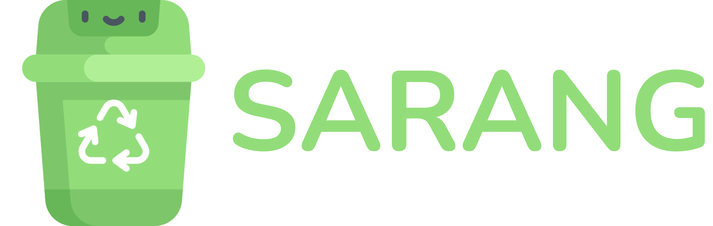
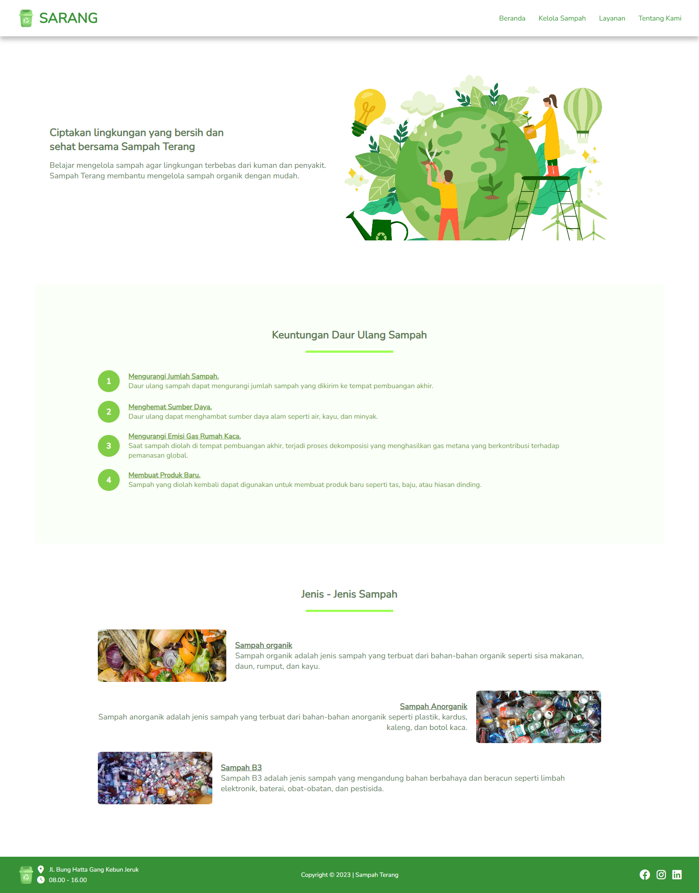
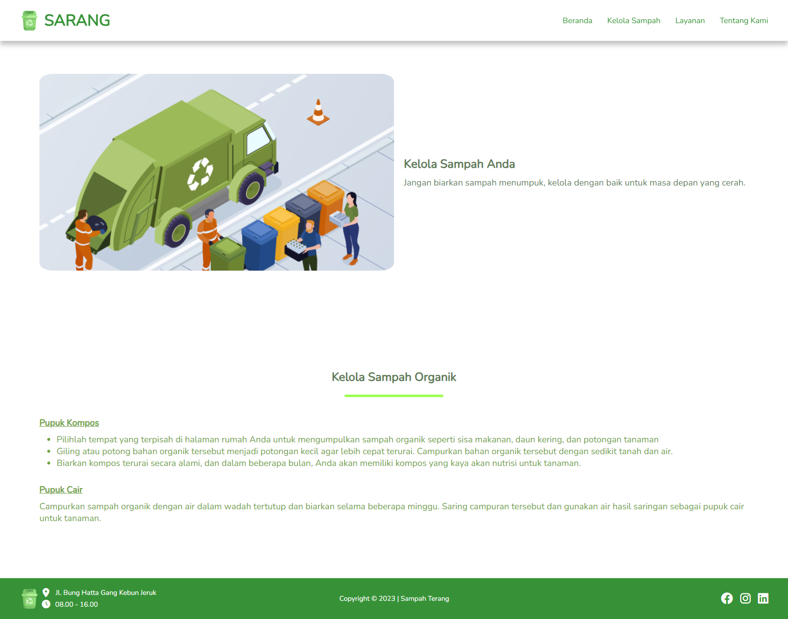
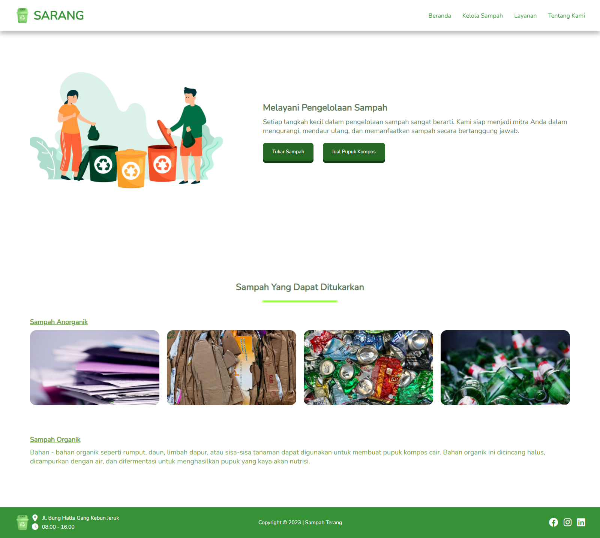
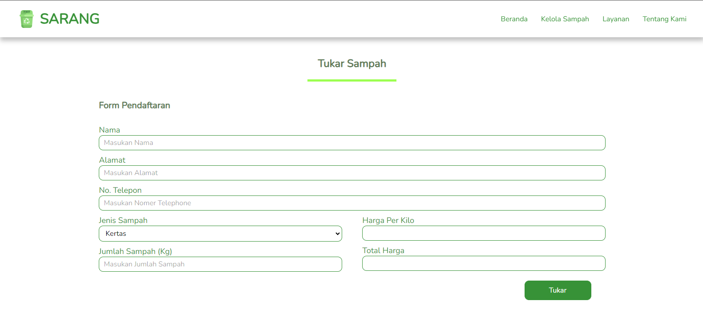
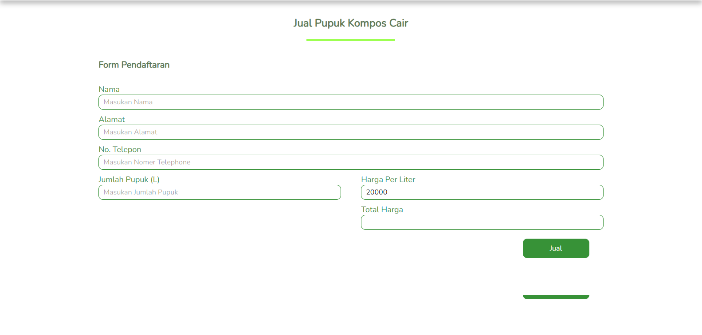
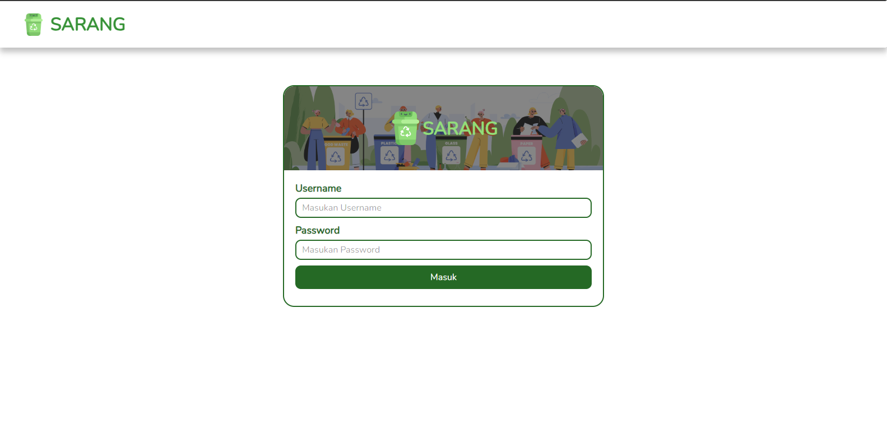
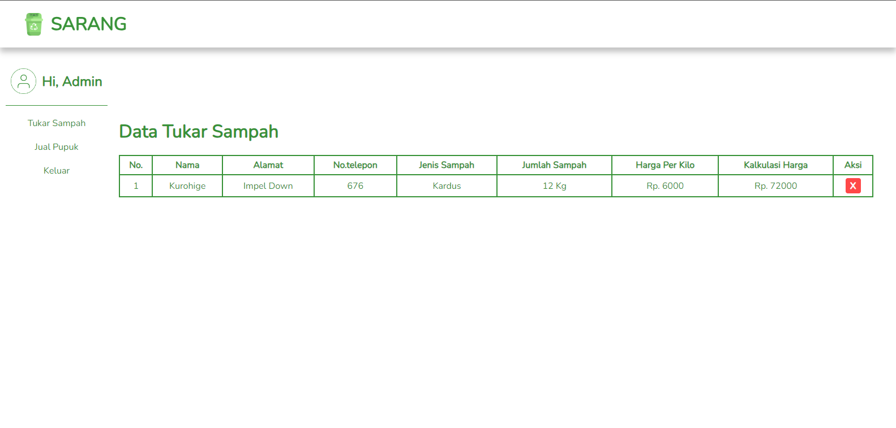
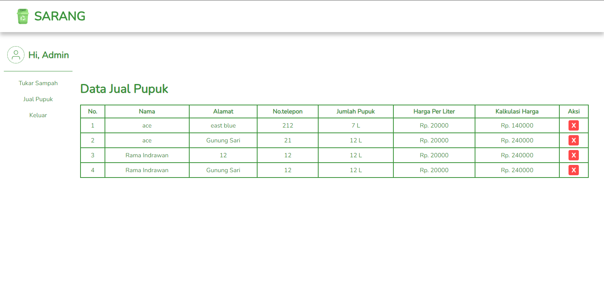
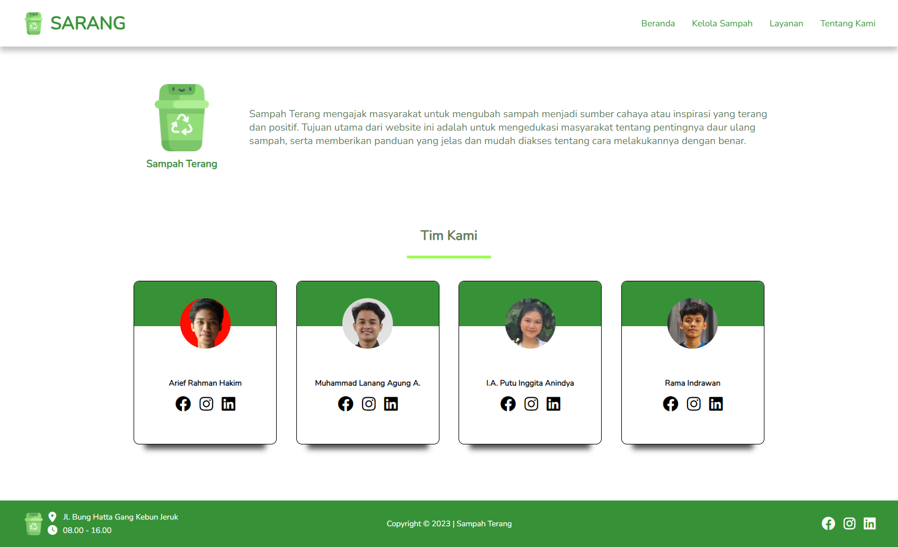

# About Sarang
Sampah Terang mengajak masyarakat untuk mengubah sampah menjadi sumber cahaya atau inspirasi yang terang dan positif. Tujuan utama dari website ini adalah untuk mengedukasi masyarakat tentang pentingnya daur ulang sampah, serta memberikan panduan yang jelas dan mudah diakses tentang cara melakukannya dengan benar.

# Demo

Silahkan Kunjungi website kami : [SARANG](https://sampah-terang.netlify.app/ "Sampah Terang").

# Team

Team ID : C23-M4003

Anggota Kelompok :

- Arief Rahman Hakim - F037XA050
- Ida Ayu Putu Inggita Anindya - F060YA278
- Muhammad Lanang Agung Anggoro - F009XA016
- Rama Indrawan - F009XA021

# Screenshots

## Beranda

## Kelola Sampah

## Layanan

## Tukar Sampah

## Jual Pupuk

## Login

## Data Tukar Sampah

## Data Jual Pupuk

## Tentang Kami

